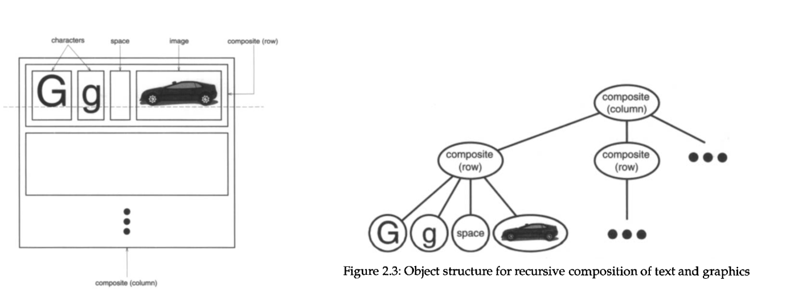
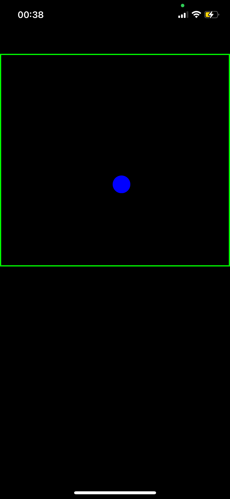
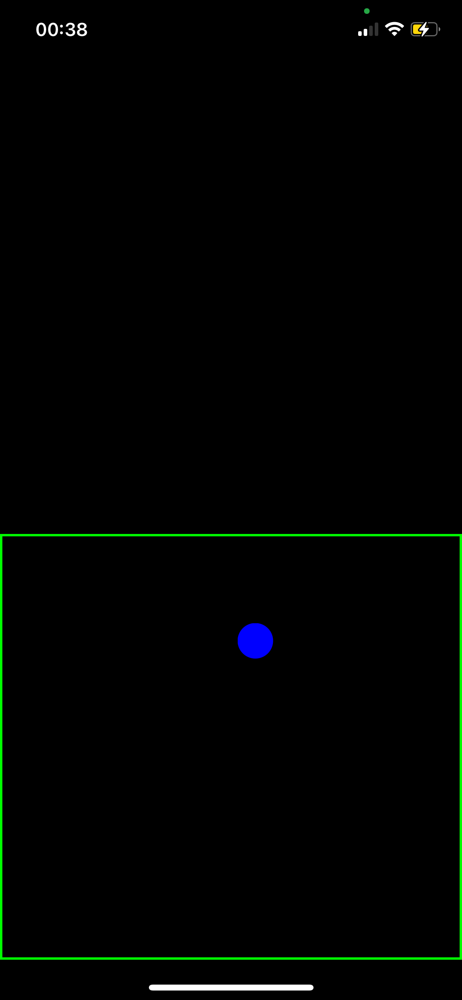
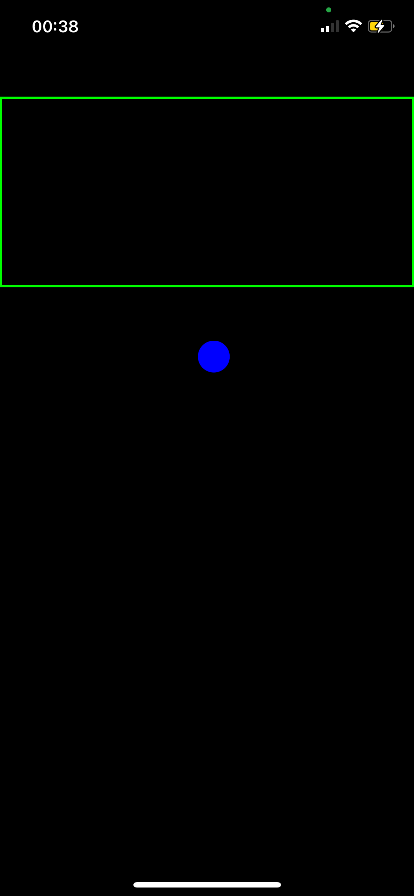
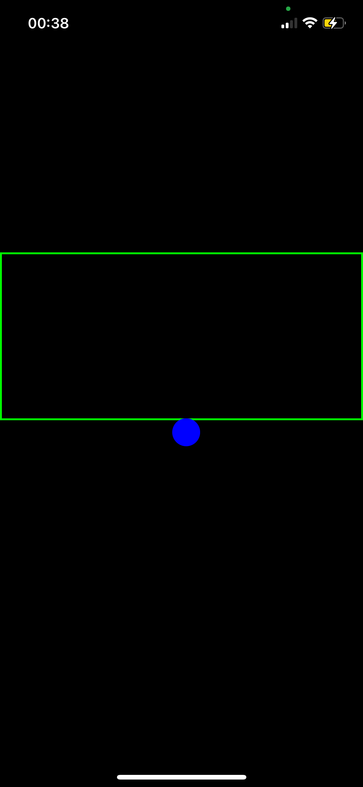

# **UITracking**  
**iOS framework for creating eye tracking-controlled interfaces**  

## 📌 **Summary**  
- [Introduction](#introduction)
- [Resources](#resources)      
- [Installation](#installation)  
- [How To Use](#how-to-use)  
- [Code Example](#code-example)  
---

## **Introduction**  
The `UITracking` is an iOS framework that enables the creation of applications controlled by eye movements. It provides essential components for capturing, interpreting and interacting via Eye Tracking.

---

## **Resources**  

The entire framework was built and tested based on **UIKit**. For better performance, it is advisable to use `UITracking` in UIKit projects as well.

---
## **Installation**  

### Via Swift Package Manager (SPM)  
1. In Xcode, go to **File > Swift Packages > Add Package Dependency**.  
2. Use the repository link as package URL:   
   ```sh
   https://github.com/apfdamascena/UITracking
   ```
3. Click on `Add package`
4. Wait until complete the loading
5. Add **Privacy - Camera usage description** on info.plist to enable the camera on your target project.
6. Done!

---
## **How To Use** 

### View Tree

The view tree concept is used in the development of graphical interfaces to organize and manage visual components in a hierarchical structure. This approach allows the composition of complex interfaces from simpler components, promoting modularity and reuse. The view tree uses trees as a data structure, in which each node represents an individual view or a group of views.



To assemble views in this way, an API was created to abstract all the complexity of building trees. The class `EyeTrackingTreeViewBuilder` is responsible to help creating this structure above

##### `EyeTrackingTreeViewBuilder`

The class presents a simple and intuitive structure for composing trees. For every n sections created, it is possible to divide the device screen into n equal parts, which present depth of views. See the example below.


```swift
        let view = EyeTrackingTreeViewBuilder()
            .addSection { node in
                node.addView(ExampleView())
                    .addViewWithEvent(ExampleView(), event: ButtonEventHandler.event)
            }
            .addSection{ node in
                node.addView(ExampleView())
            }.build()

```

This code divides the screen into two parts, where the upper part contains two subdivisions and the lower part contains only one. Here is an example of how it looks on the device:

<p align="center">
  
  
  
  
</p>

There are three important functions on `EyeTrackingTreeViewBuilder`:

1. **addSection** - responsible for adding a section to the screen. The number of sections defines how many times the screen will be divided.
2. **addView** - responsible for adding a view to a section on the screen.
3. **addViewWithEvent** - responsible for adding a view to a section with  an event registered in the element.

##### `EyeTrackerEventHandler`

To add an event to a view, you must first create its handler from the EyeTrackerEventHandler interface. Here an example that routes to another screen, but is possible to create others actions.

```swift
class ButtonEventHandler: @preconcurrency EyeTrackerEventHandler {
    static var event: String = "user-tap-buttton-event-handler"
    
    @MainActor func execute(on controller: UITracking.EyeTrackingViewController) {
        
        let newView = EyeTrackingTreeViewBuilder()
            .addSection { node in
                node.addView(ExampleView())
            }
            .addSection{ node in
                node.addView(ExampleView())
            }.build()
        
        let newController = EyeTrackingViewController(view: newView,
                                                      datasource: controller.datasource,
                                                      delegate: controller.delegate)
        
        controller.navigationController?.pushViewController(newController, animated: true)
    }
}

```

##### `EyeTrackingViewController`

Behave as a main component, where it connects all the others, such as the tracker, adapters and views, ensuring that data flows correctly between them. It is advisable that you inherit `EyeTrackingViewController` when creating a new view controller. Here an example:


```swift
class HomeViewController: EyeTrackingViewController {
    
    init(homeView: EyeTrackingView){
        super.init(view: homeView)
        setupEvents()
    }
    
    func setupEvents(){
        datasource.commandBus.registerEvent(ButtonEventHandler.event,
                                            handler: ButtonEventHandler())
    }
    
    @MainActor required init?(coder: NSCoder) {
        fatalError("init(coder:) has not been implemented")
    }
}
```
##### `CommandBus`

You must use the commandBus that is embedded in the datasource to register and delete events for a given view.

```swift    
func setupEvents(){
    datasource.commandBus.registerEvent(ButtonEventHandler.event,
                                        handler: ButtonEventHandler())
}
```

## **Code Example** 

```swift
//
//  ViewController.swift
//  tracking-test
//
//  Created by alexdamascena on 30/01/25.
//

import UIKit
import UITracking


class ExampleView: EyeTrackingView {
    
    override func addSubviews() {
        self.backgroundColor = .white
    }
        
    override func borderColor() {
        self.layer.borderColor = UIColor.red.cgColor
    }
    
    override func borderWidth() {
        self.layer.borderWidth = 3
    }

}

class ButtonEventHandler: @preconcurrency EyeTrackerEventHandler {
    static var event: String = "user-tap-buttton-event-handler"
    
    @MainActor func execute(on controller: UITracking.EyeTrackingViewController) {
        
        let newView = EyeTrackingTreeViewBuilder()
            .addSection { node in
                node.addView(ExampleView())
            }
            .addSection{ node in
                node.addView(ExampleView())
            }.build()
        
        let newController = EyeTrackingViewController(view: newView,
                                                      datasource: controller.datasource,
                                                      delegate: controller.delegate)
        
        controller.navigationController?.pushViewController(newController, animated: true)
    }
}

class HomeViewController: EyeTrackingViewController {
    
    init(homeView: EyeTrackingView){
        super.init(view: homeView)
        setupEvents()
    }
    
    func setupEvents(){
        datasource.commandBus.registerEvent(ButtonEventHandler.event,
                                            handler: ButtonEventHandler())
    }
    
    @MainActor required init?(coder: NSCoder) {
        fatalError("init(coder:) has not been implemented")
    }
}
```

